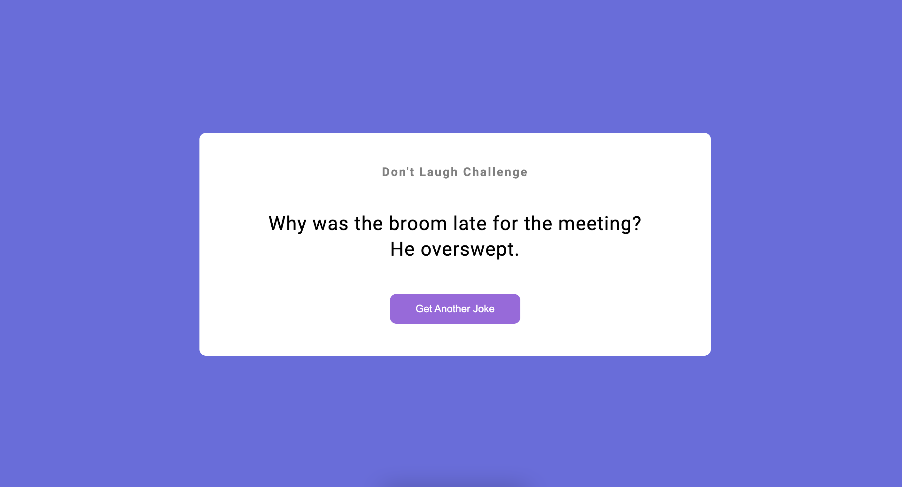

# Joke Generator Web App

> Generates Jokes(of course, funny😂) using an open-source API.

It uses this [API](https://v2.jokeapi.dev/) to generate jokes on the click.

JavaScript `fetch()` method is used for handling the API.

The deployed link is [here](https://jokesonly.netlify.app)